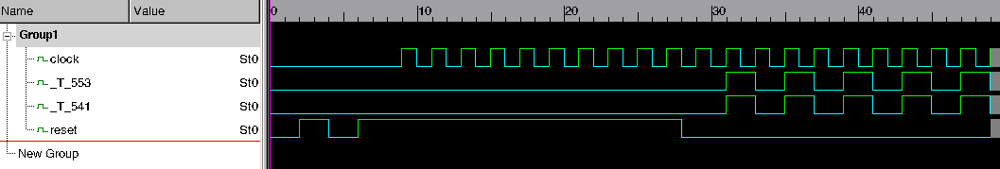

### Setup

**Note**: I suggest you use make parallelism on any Make command


#### Assumed dependencies

`git`, `g++`, `make`, `autoconf`

#### Less common dependencies

Ubuntu instructions
```bash
# device-tree-compiler
apt-get install device-tree-compiler
```

MacOS instructions (using Homebrew)
```bash
# device-tree-compiler
brew install dtc
```

#### Required Setup

Clone the repo and checkout submodules

```bash
git clone https://github.com/jackkoenig/verilator-fatal-issue.git
cd verilator-fatal-issue
git submodule update --init
```

Build riscv-isa-sim (the simulation environment needs RISC-V fesvr)

```bash
cd riscv-isa-sim
./configure --prefix=$PWD/install
make install
```

Install Verilator (https://www.veripool.org/projects/verilator/wiki/Installing) and set `VERILATOR` to point to the binary
(or just make sure it's on your `PATH`)

```bash
export VERILATOR=/path/to/verilator/bin/verilator
```

### Reproducing the issue

```bash
# From the root directory of this repository
make
```

You should see something like:
```
fatal: _T_541 = 1, _T_553 = 0, reset = 0
[16] %Error: TLMonitor_31.v:268: Assertion failed in TOP.TestHarness.ldut.debug.dmOuter.dmiXbar.monitor
%Error: /path/to/repo//generated-src/TLMonitor_31.v:268: Verilog $stop
Aborting...
```

You can generate a VCD by setting `DEBUG`

```bash
# Need to clean between builds when setting environment variables
make clean

DEBUG=1 make
```

Because `$fatal` kills the simulation right away, you miss the final cycle.
You can extend the simulation a few cycles (until intentional timeout) like so:

```bash
make clean

DEFINES="NONFATAL=1" DEBUG=1 make
```

Viewing the VCD from this extended run illustrates the issue. For example:



Module to look inside: `TOP.TestHarness.ldut.debug.dmOuter.dmiXbar.monitor`

### The issue

Here's the code in question (in `generated-src/TLMonitor_31.v`):
```verilog
always @(posedge clock) begin
  ...
  `ifndef SYNTHESIS
  `ifndef SUPPRESS
  if (_T_476 & (~(_T_493 | reset))) begin
    $fatal; // @[Monitor.scala 44:11]
  end
  `endif // SUPPRESS
  if (_T_541 & (~(_T_553 | reset))) begin
    $display("fatal: _T_541 = %d, _T_553 = %d, reset = %d", _T_541, _T_553, reset);
    `ifndef NONFATAL
    $fatal; // @[Monitor.scala 51:11]
    `endif // NONFATAL
  end
  `endif // SYNTHESIS
end
```

There are two `$fatal` calls here, the second is the problematic one.
Once out of reset (`reset == 0`), the error will fire when `_T_541 == 1` and `_T_553 == 0`.
This is reflected in the failing print:
```
fatal: _T_541 = 1, _T_553 = 0, reset = 0
```

However, when you view the waveform, `_T_541` and `_T_553` are always the same.

### Strange behavior

You'll see in the Verilog above, that there is a `SUPPRESS` define for hiding another `$fatal` that
is totally unrelated to the one with the `$display`.
If you define this variable, removing the first `$fatal`, the issue doesn't manifest:

```bash
make clean

DEFINES="NONFATAL=1 SUPPRESS=1" DEBUG=1 make
```

With this change, the unrelated `$fatal` is suppressed.
Suprisingly the problematic one also doesn't fire.

### Additional information

* The issue manifests on Verilator optimization levels `O1` and `O2` but does **not** manifest on `O0`
* The issue manifests on every Verilator version I tried: v4.040-70-g600641b, v4.040, v4.036, v4.032, and v4.008

